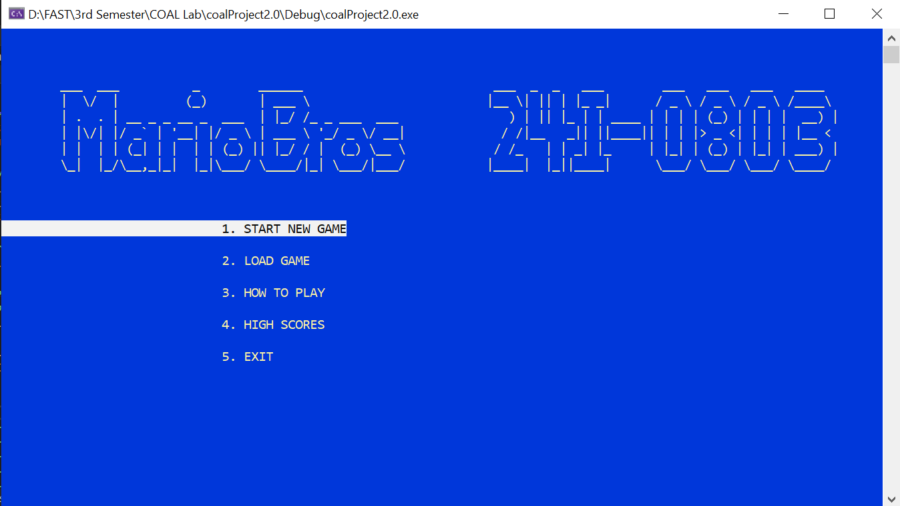
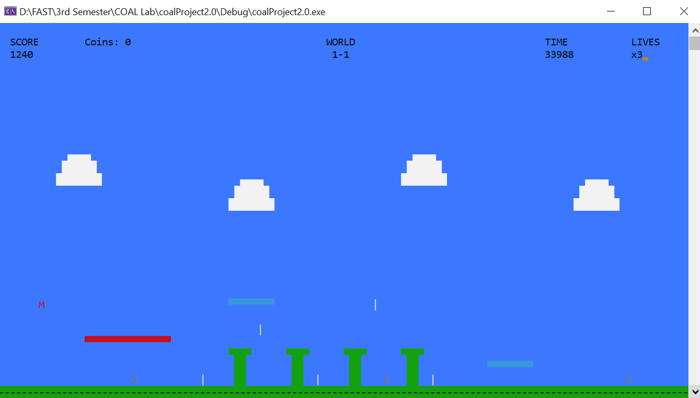
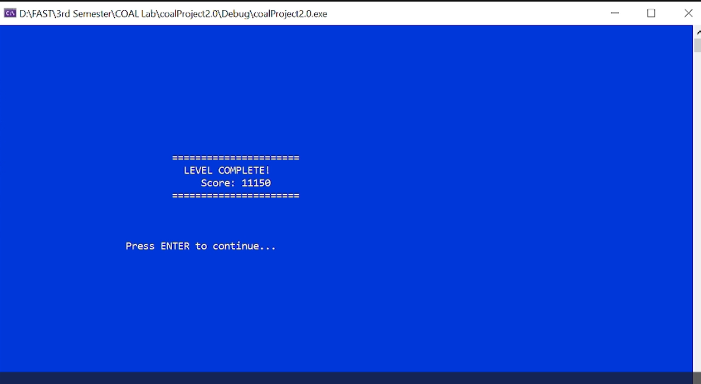

# Mario Assembly Console Game 🍄

A console-based Mario-style platformer developed entirely in x86 Assembly Language using MASM, Irvine32, winmm.lib, and Visual Studio.

This project was developed for the Computer Organization & Assembly Language (COAL) course at FAST-NUCES Islamabad.

---

## Overview

This project recreates classic Mario-style gameplay mechanics in pure Assembly Language, demonstrating low-level programming concepts through a fully playable console game with multiple levels, enemies, physics, scoring, save/load systems, and boss battles.

The game contains more than **5000 lines of Assembly code** and was built without high-level game engines or frameworks.

---

## Features

### 🎮 Gameplay

- 2 complete levels
- 2 phases in each level
- Coin collection system
- Multiple enemy types
- Moving obstacles and platforms
- Boss battle in Level 2
- Score tracking system
- Save/load functionality
- High score management

### ⚡ Special Abilities

- Speed Boost ("Turbo Star")
- Giant Mario mode
- Dynamic movement mechanics

### 🧠 Enemy Mechanics

- Goomba-style enemies
- Koopa-style enemies
- Boss enemy AI
- Enemy patrol and collision logic

### 🖥 Interface & Visuals

- Console-rendered graphics
- Dynamic HUD
- Animated gameplay elements
- Color-coded UI
- Multiple gameplay screens and menus

### 🔊 Audio

- Background music support using Windows Multimedia API

---

## Technologies Used

- x86 Assembly Language
- MASM615
- Irvine32 Library
- winmm.lib
- Visual Studio

---

## Assembly Concepts Implemented

- Register-based programming
- Memory management
- Jump-based control flow
- Procedural decomposition
- Collision detection
- Frame-based animation
- File handling
- Console rendering
- Game loop implementation

---

## Controls

| Key     | Action     |
| ------- | ---------- |
| W / ↑   | Jump       |
| A / ←   | Move Left  |
| D / →   | Move Right |
| S / ↓   | Crouch     |
| P / ESC | Pause      |
| X       | Exit Game  |

---

## Screenshots

### Main Menu



### Gameplay



### Level Completion



## Watch Gameplay on LinkedIn

[AssemblyGameplay](https://www.linkedin.com/feed/update/urn:li:ugcPost:7464075198401622016/)

---

## Project Structure

```text
mario-assembly-console-game/
│
├── Game.asm
├── README.md
├── highscores.txt
├── savegame.txt
│
├── Resources/
│   └── background.wav
│
├── Screenshots/
│   ├── menu.png
│   ├── gameplay.png
│   └── level_completion.png
│
└── docs/
```

---

## How to Run

### Requirements

- Windows OS
- MASM615
- Irvine32 Library
- Visual Studio

### Setup

1. Ensure Irvine32 is correctly configured
2. Place `background.wav` inside the `Resources/` folder
3. Build and run the Assembly source file

---

## Academic Context

This project was developed for the COAL course at FAST-NUCES Islamabad as part of low-level programming and computer organization studies.

---

## Developer

Syed Faizan Haider

---

## Note

This project was created for educational purposes only.
